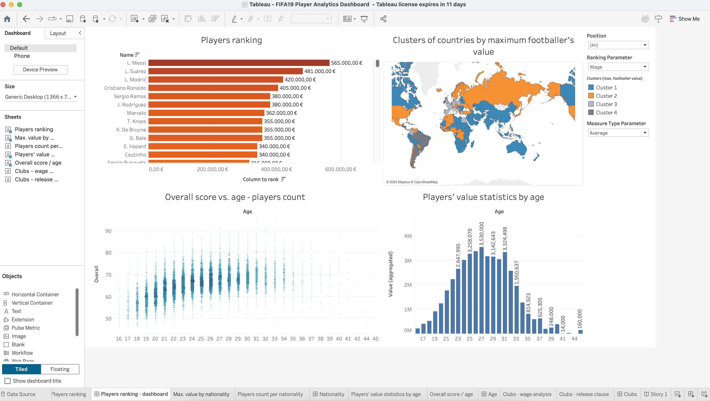
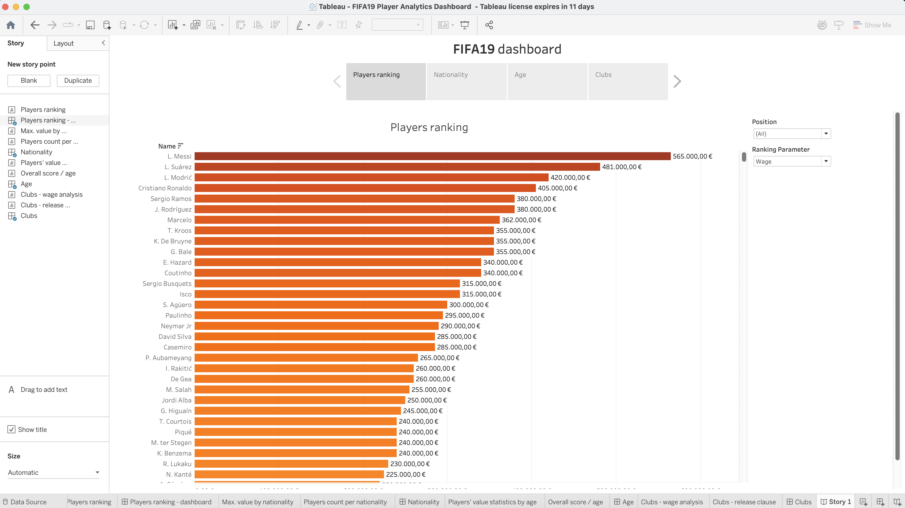

# FIFA19 Player Analytics Dashboard

Interactive Tableau story analyzing footballer financial data and skill profiles. Visualizes player values, wages, release clauses, and performance metrics across positions, clubs, and nationalities using FIFA19 game data.

## Project Overview

This project analyzes FIFA19 player data through multiple interactive dashboards that explore:
- Financial profiles (values, wages, release clauses)
- Player skill distributions across positions
- Performance metrics and correlations
- Demographic analysis by nationality and age

## Dataset Description

The analysis uses two main datasets:

### fifa_players.csv
- **Id**: Player identifier
- **Age**: Player age
- **Name**: Player name and surname
- **Club**: Player club
- **Nationality**: Player nationality
- **Position**: Field position
- **Preferred Foot**: Preferred foot (right/left)
- **Release Clause**: Contract buyout amount (€)
- **Value**: Player market worth (€)
- **Wage**: Weekly wage (€)

### fifa_players_statistics.csv
- **Id**: Player identifier
- **Skills**: Acceleration, Balance, Ball Control, Crossing, Dribbling, Finishing, Jumping, Positioning, Stamina (0-100 scale)
- **Overall**: General player rating (0-100)

## Dashboard Screenshots

### Data Source Overview

*Overview of data sources and structure used in the analysis*

### Player Rankings

*Top players ranked by overall rating across different positions*

### Top Player Values

*Highest valued players and market analysis*

### Player Count by Nationality

*Distribution of players across different nationalities*

### Nationality Analysis Dashboard

*Detailed nationality-based analysis dashboard*

### Age Analysis Dashboard

*Player age distribution and performance correlation analysis*

### Age-Based Statistics

*Statistical breakdown of performance metrics by age groups*

### Performance vs Age

*Correlation between player age and overall performance*

### Main Dashboard

*Main dashboard displaying key financial and performance metrics*

### Financial Details

*Comprehensive financial breakdown of player values and wages*

### Wage and Performance Clusters

*Clustering analysis of wages vs overall ratings*

### Release Clause Analysis

*Analysis of release clause distributions*

### Complete Story

*Complete Tableau story showing the narrative flow of FIFA19 player analysis*

### Wage and Performance Clusters

*Clustering analysis of wages vs overall ratings*


## Tools Used
- **Tableau Desktop**: Data visualization and dashboard creation
- **CSV Data Processing**: FIFA19 player datasets
- **Statistical Analysis**: Performance correlations and clustering

##  Key Insights

- **Financial Trends**: Analysis reveals correlation patterns between player age, performance, and market value
- **Position Analysis**: Different positions show distinct skill profile requirements
- **Nationality Patterns**: Certain countries dominate specific position categories
- **Age Factor**: Performance peaks and wage distributions vary significantly by age groups

##  Project Structure


```

tableau-project/
├── README.md
├── Story.png
├── Dashboard.png
├── Dashboard age.png
├── Dashboard nationality.png
├── Count per nationality.png
├── Players ranking.png
├── Players financial details.png
├── Max value.png
├── Release clause.png
├── Score vs age.png
├── Statistic by age.png
├── Wage and overall clusters.png
└── Data source.png

```
##  Author

**Milica Antic**
- GitHub: [@milicaantic01](https://github.com/milicaantic01)

## License

This project is open source and available under the [MIT License](LICENSE).

---

*Built with Tableau Desktop • Data from FIFA19 Game Dataset*
